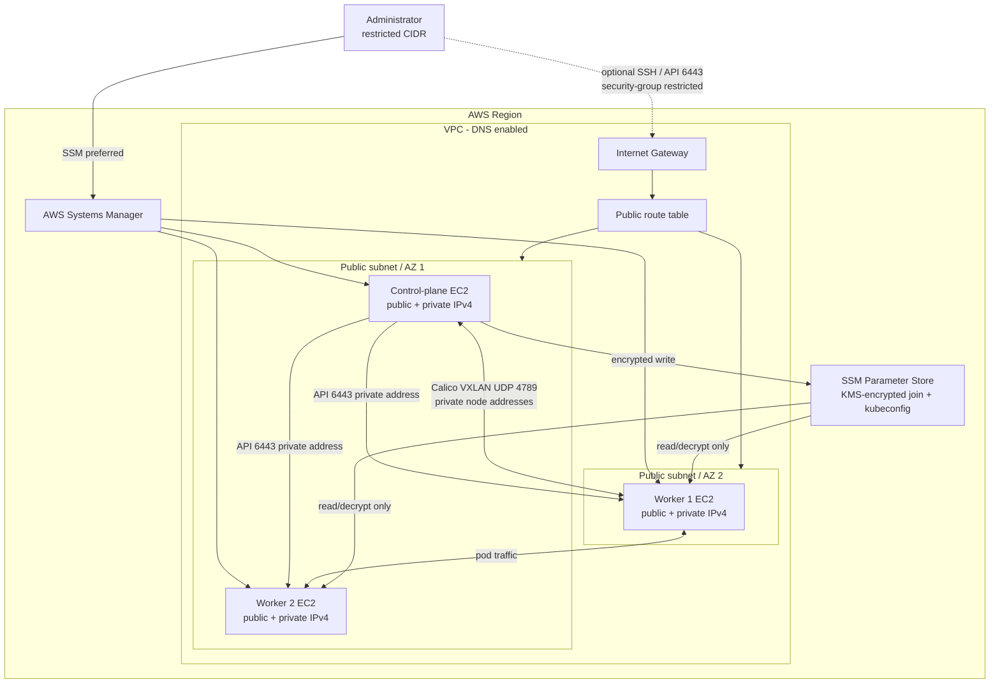

# AWS kubeadm Kubernetes cluster

This project provisions a self-managed Kubernetes cluster on AWS: one Ubuntu
24.04 control-plane and two Ubuntu 24.04 workers, containerd, kubeadm, and
Calico VXLAN. It does not use EKS, private subnets, NAT gateways, bastions, or
Terraform provisioners.

The version defaults were resolved on 2026-07-26: Kubernetes `1.35.6` from the
official Kubernetes releases page, Calico `v3.32.0`, Terraform `~> 1.15.0`, and
AWS provider `~> 6.55.0`. Review release compatibility before changing pins.

> **Public-node warning:** This topology suits labs, demonstrations,
> development, and tightly controlled environments. Public IPv4 addresses
> increase exposure and cost. Production nodes are generally better in private
> subnets using NAT or VPC endpoints and a highly available API endpoint.

## Architecture



Every instance receives a public and private IPv4 address. The IGW/default
route provides package, registry, AWS API, SSM, and manifest egress. Kubernetes
API and pod overlay traffic use private addresses; public addresses are not
part of pod-to-pod routing.

## Prerequisites and authentication

Install Terraform 1.15, AWS CLI v2, kubectl, and the Session Manager plugin.
Configure AWS credentials with `aws configure --profile default`, SSO, or
environment/role credentials, then verify:

```bash
aws sts get-caller-identity --profile default
```

The deploying identity needs EC2, VPC, IAM, SSM Parameter Store, and KMS
permissions for resources in this project. Terraform state contains resource
metadata and placeholder parameter values, never the runtime join token or
kubeconfig. Protect remote state nonetheless.

## Configure and deploy

```bash
cp terraform.tfvars.example terraform.tfvars
# Replace 203.0.113.10/32 with your real public IPv4 address in /32 form.
terraform init
terraform fmt -recursive
terraform validate
terraform plan -out=tfplan
terraform apply tfplan
```

Terraform creates the network first. Cloud-init then installs Linux
prerequisites and pinned packages, initializes the control-plane against its
private DNS endpoint, installs pinned Calico, and writes a two-hour kubeadm join
command as a KMS-encrypted SecureString. Workers retry for at most 15 minutes,
decrypt it in memory, join, and create completion markers. Reboots do not rerun
`kubeadm init` or `kubeadm join` because the scripts check Kubernetes config
files. Terraform apply finishing means EC2 resources exist, not necessarily
that cloud-init has finished.

Calico uses VXLAN (`encapsulation: VXLAN`), avoiding BGP route integration with
AWS. UDP 4789 is allowed only by node security-group references. Pod packets
are encapsulated between private node IPs; public IPs play no role.

## Retrieve access, connect, and verify

The retrieval script validates AWS auth, locates the tagged control-plane,
decrypts kubeconfig without printing it, changes only its client endpoint to
the instance's public DNS (whose certificate SAN is installed), and writes
mode `0600`. TCP 6443 must be enabled for your real `allowed_admin_cidr`.

```bash
./scripts/get-kubeconfig.sh \
  --region ap-south-1 \
  --cluster-name kubeadm-dev
export KUBECONFIG="$PWD/kubeconfig-kubeadm-dev"
./scripts/verify-cluster.sh

CLUSTER_NAME=kubeadm-dev AWS_REGION=ap-south-1 ./scripts/connect-ssm.sh control-plane
CLUSTER_NAME=kubeadm-dev AWS_REGION=ap-south-1 ./scripts/connect-ssm.sh worker-1
CLUSTER_NAME=kubeadm-dev AWS_REGION=ap-south-1 ./scripts/connect-ssm.sh worker-2
```

SSH is off by default. It is created only when both
`enable_ssh_access = true` and a pre-existing `ssh_key_name` are set, and is
limited to `allowed_admin_cidr`. Terraform never manages private keys.
NodePorts are likewise off by default; enabling them permits TCP/UDP
30000-32767 only from the administrator CIDR.

## Security and IAM review

IMDSv2 is mandatory and EBS volumes and SSM values use the rotating project KMS
key. etcd, scheduler, controller-manager, kubelet, kube-proxy, and Calico are
never publicly exposed. Separate control-plane and worker groups use group
references internally. The public API and optional SSH/NodePort rules reject
`0.0.0.0/0` through variable validation.

Both roles attach `AmazonSSMManagedInstanceCore` solely for Session Manager.
The control-plane custom policy can get/put parameters only under
`/kubeadm/<cluster>/*` and encrypt/decrypt/data-key only with the project key.
Workers can get only the exact join parameter and decrypt only with that key;
they cannot modify it. Optional logging grants only stream creation/event
writes under `/kubeadm/<cluster>`. EC2 metadata needs no IAM permission.

Unrestricted outbound is deliberate because bootstrapping requires Ubuntu and
Kubernetes repositories, registries, GitHub-hosted pinned Calico manifests,
SSM endpoints, STS, KMS, and SSM APIs. For production, replace this with
private networking/endpoints, egress filtering, HA control planes, centralized
logs, and managed lifecycle controls.

## Scaling workers

Set `worker_count = 3`, plan, and apply. Count-based placement alternates
subnets; every new worker receives the worker profile/group, public address,
encrypted disk, user-data, and securely retrieved join command. Before reducing
count, drain and remove the highest-numbered node that Terraform will destroy:

```bash
kubectl drain <node-name> --ignore-daemonsets --delete-emptydir-data
kubectl delete node <node-name>
```

## Kubernetes upgrades

Do not rely on changed user-data to upgrade existing nodes. Follow the
Kubernetes version-skew policy and upgrade one minor release at a time:

1. Back up etcd and validate health. On the control-plane, upgrade kubeadm
   first, run `kubeadm upgrade plan` and `kubeadm upgrade apply vX.Y.Z`, then
   upgrade/restart kubelet and kubectl.
2. Drain worker 1, upgrade kubeadm, run `kubeadm upgrade node`, upgrade/restart
   kubelet, then `kubectl uncordon`.
3. Verify health and repeat for worker 2. Test nodes, system pods, DNS, and
   workloads after every node.

Update both Terraform version variables only for future/replaced instances.
Ensure the minor repository matches the patch version.

## Troubleshooting

Use SSM to enter a node, then inspect:

```bash
sudo systemctl status containerd
sudo systemctl status kubelet
sudo journalctl -u containerd
sudo journalctl -u kubelet
sudo cat /var/log/kubeadm-bootstrap.log
sudo cloud-init status --long
sudo crictl ps -a
sudo kubeadm token list
kubectl get nodes -o wide
kubectl get pods -A
kubectl describe node <node-name>
```

- Init/cloud-init failure: inspect the bootstrap log, cloud-init status,
  `/etc/kubernetes-kubeadm-config.yaml`, DNS, package repository, and image
  registry reachability. Validate rendered user-data with `terraform console`.
- Join failure/expired token: check worker IAM, KMS decrypt, parameter value,
  private DNS, TCP 6443 rules, and token expiry. On the control-plane create a
  new two-hour command and overwrite the SecureString without echoing it, then
  restart cloud-init or execute it securely on the unjoined worker.
- Calico or `NotReady`: confirm UDP 4789 rules, matching pod CIDR, IP forwarding,
  `br_netfilter`, Calico/Tigera pod logs, and that `SystemdCgroup = true` in
  `/etc/containerd/config.toml`.
- No Internet/public IP: confirm subnet public-IP mapping, instance association,
  IGW attachment, `0.0.0.0/0` route, association, DNS settings, and outbound SG.
- SSM offline: verify Internet route, DNS, instance profile, SSM agent, clock,
  and `AmazonSSMManagedInstanceCore`.
- Parameter/KMS denial: use CloudTrail/IAM simulation; workers need exact
  `ssm:GetParameter` and `kms:Decrypt`, while only the control-plane may put.
- Local API/SSH failure: replace the example CIDR, confirm your current public
  IP, flags, key name, public DNS, route, NACL, and security-group rule.
- Package failure: verify the configured `v1.x` repository exists and exact
  `x.y.z-1.1` package is published.

## Cost and destruction

Primary cost drivers are three EC2 instances, gp3 EBS, public IPv4 charges,
data transfer, KMS requests, Parameter Store usage, and optional detailed
monitoring/log ingestion. There is no NAT gateway or bastion cost. Consult
current AWS pricing rather than assuming fixed prices.

Before destroy, back up needed Kubernetes objects/data, export application
manifests, save required kubeconfigs, and confirm no important workloads
remain. EC2 and their root EBS volumes will be removed.

```bash
terraform plan -destroy
terraform destroy
```

Terraform also removes the instances, SSM parameters, KMS alias/key (scheduled
for seven-day deletion), IAM roles/profiles/policies, groups, route table,
subnets, IGW, and VPC.
